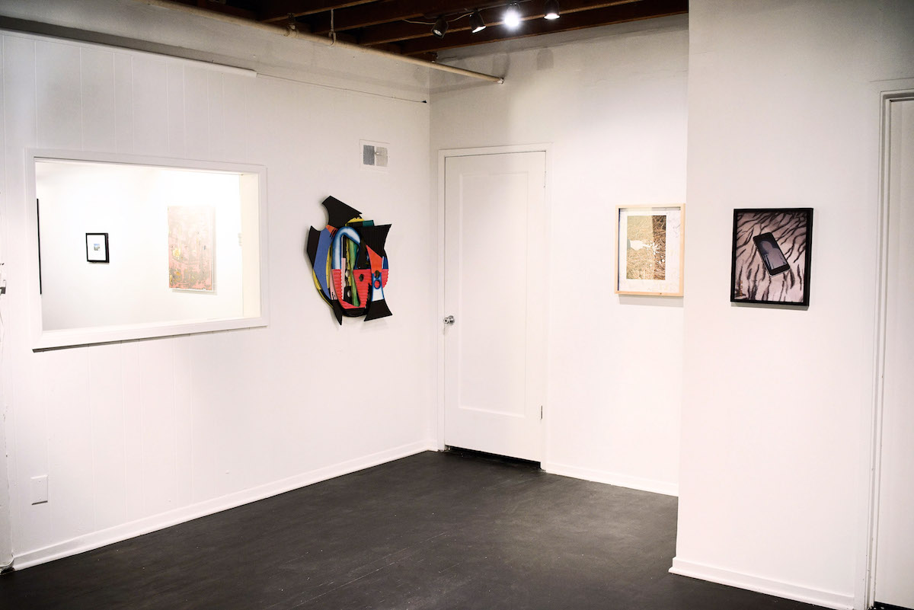
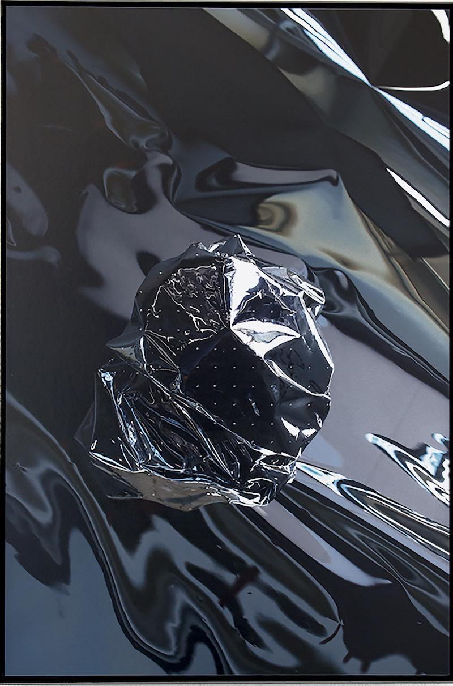
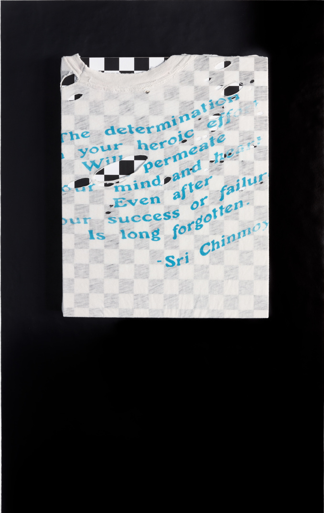

# ALIEN ARTIFACTS

*HIT Gallery is pleased to announce our premier opening show 'ALIEN ARTIFACTS' curated by gallery co-owner Marissa Leitman. The show represents a broad range of disciplines but loosely focuses on domestic imagery and the expectations of materials within specific art practices. By subverting the traditional display methods of a work of art or object one is must reevaluate what it does and it’s place in the world.‘Alien Artifacts’ inspects unexamined principles of humanity. The exhibition is on view February 8th, 2018 - March 5th, 2018 by appointment, with an opening reception on Thursday, February 8th between 7 - 9:30pm.*

<figure>
  
  
  
</figure>

**Alice Shaw** is a Bay Area based photographer. Alice uses photography or photographic based imagery to  explore themes of doubles, liminality, and representation.  She currently teaches at California College of the Arts.

Self-described as simply “an artist” **Graham Holoch’s** work commonly combines collage, photography and drawing. His images, which are sharp and often use flash, give the feeling snapshots with the rhetoric of  commercial seduction. He is the founding editor and a contributor of EggyPress.

**Henry Fey’s** work offers “an examination of digital and analog methods of image production”. He plays with the form of the canvas and the distinction between sculpture and painting. His first solo show was at Good Mother Gallery in May of 2017.

Using photography, Bay Area based artist **Jack Bool** explores the beauty and strangeness of the suburban and the pedestrian.

Raised in a blue collar christian household, religious themes remain a ubiquitous  source of inspiration in **Taylor Johnson’s** photographic practice. Enamored by the specific brand of Americana unique to the Central Valley of California, her work is truly obsessed with the West Coast’s role of “telephone” in the tradition it represents.

**Siqi Lin** is a photographer. her work which holds a Samuel Beckett like quality and inspects means of visually representing language, mapping, and the ephemeral.  

**Nadair Asghari** is a multi media artist. He often works with plexiglass layered over spray paint and soft pastel. He describes his work as playful abstraction.

<figure>
  
  
  
</figure>
